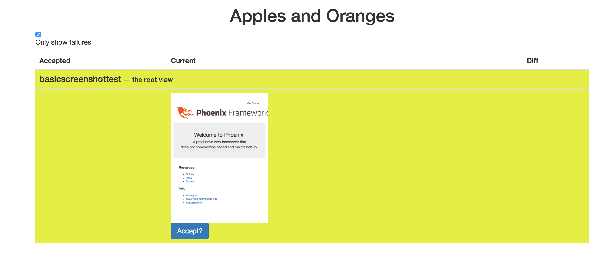
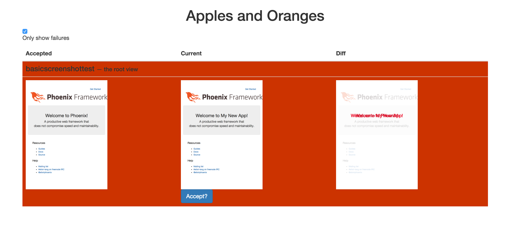

# ApplesAndOranges

Screenshot-driven tests for Phoenix projects.

## Installation

### Requirements

#### ImageMagick

If you are using [Homebrew](http://brew.sh), you can install it with:

    brew install imagemagick

#### Webdriver Server

`ApplesAndOranges` uses [Hound](https://github.com/HashNuke/hound/) to take screenshots, and by default uses [PhantomJS](http://phantomjs.org/).
Any other webdriver server Hound [supports](https://github.com/HashNuke/hound/#features) should also work, but needs to be specified when running tests using the `WEBDRIVER` environment variable.

### Installing ApplesAndOranges

If [available in Hex](https://hex.pm/docs/publish), the package can be added to your list of dependencies in `mix.exs`:

    def deps do
      [{:apples_and_oranges, "~> 0.0.1"}]
    end

Otherwise, you can add it to your dependencies from GitHub:

    def deps do
      [{:apples_and_oranges, github: "mikowitz/apples_and_oranges"}]
    end

## Usage

### Config

In `config/confix.exs` you need to set two values for `ApplesAndOranges`:

    config :apples_and_oranges, static_app: <your_app_name_here>
    config :apples_and_oranges, router: ApplesAndOranges.router

You also need to config `Hound` to run the webdriver:

    hound_driver = System.get_env("WEBDRIVER") || "phantomjs"
    config :hound, driver: hound_driver, host: "http://localhost", app_port: 4000

Per environment, you should assign a port for `ApplesAndOranges` to use:

    config :apples_and_oranges, port: 1985

In `test/test_helper.exs`, ensure `Hound` is running:

    Application.ensure_all_started(:hound)

These will hopefully, eventually be set as defaults, but for now be sure to set a different port number for dev and test environments, otherwise you will not be able to run tests with the `ApplesAndOranges` server running. Also something I hope to correct in a future version.

### In your tests

    defmodule SampleAppScreenshotTesting do
      use ExUnit.Case
      use ApplesAndOranges

      use Hound.Helpers
      hound_session

      test "taking a screenshot works", context do
        navigate_to("/")

        it_looks_like(context, "the root screen")
      end
    end

You need to make sure you pass `context` into any test that uses `ApplesAndOranges`, and `context` must always be the first argument passed to `it_looks_like`. If you exclude the second argument, `ApplesAndOranges` will use the name of the test block in the screenshot path name.

The first time you run your tests after adding this, this test will raise an error, saying "No accepted screenshot." This is expected.

### Webview

Now, in your app's home directory, run

    mix apples_and_oranges.server

and, in your web browser, navigate to `http://localhost:<the port you set in your dev config>`. You should see a table with the captured screenshot, and a button offering you the option to "Accept?" that screenshot.

Once you do that, the screen should clear, and, if you `mix test` again, your tests should pass.

Going forward, if you make changes (intentionally or otherwise) to this page of your site, this test will fail, and, navigating back to the `ApplesAndOranges` web app, you will see the latest accepted screenshot, the new, current screenshot, and a diffed image between the two.

If the changes _were_ intentional, simply accept the new current screenshot. If not, you've got some work to do.
